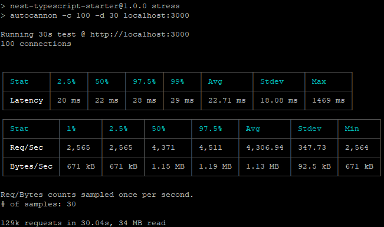

# Nest Test Project

This repository contains a test task to demonstrate your ability to optimize code.

## Level 0

- Tell the interviewer what this code does.

## Task Instructions

- **Goal:** Optimize the project code for maximum performance.
- **Restrictions:**  
  - You may change any code **except** files in the `system` folder.
- **Time Limit:**  
  - Expected completion time is **45-50 minutes**.
- **Resources:**  
  - You may use any sources or references to achieve the target.

## Running the Project

- **Start Development Server:**  
  ```bash
  npm run dev
  ```
- **Run Stress Test:**  
  ```bash
  npm run stress
  ```

## Results

- The maximum result achieved can be found in the target.png file.



# Additional Tasks
- Coverage:  
  - Ensure that the code is covered by tests.
  - Use `npm run test` to run the tests.

---
Good luck!